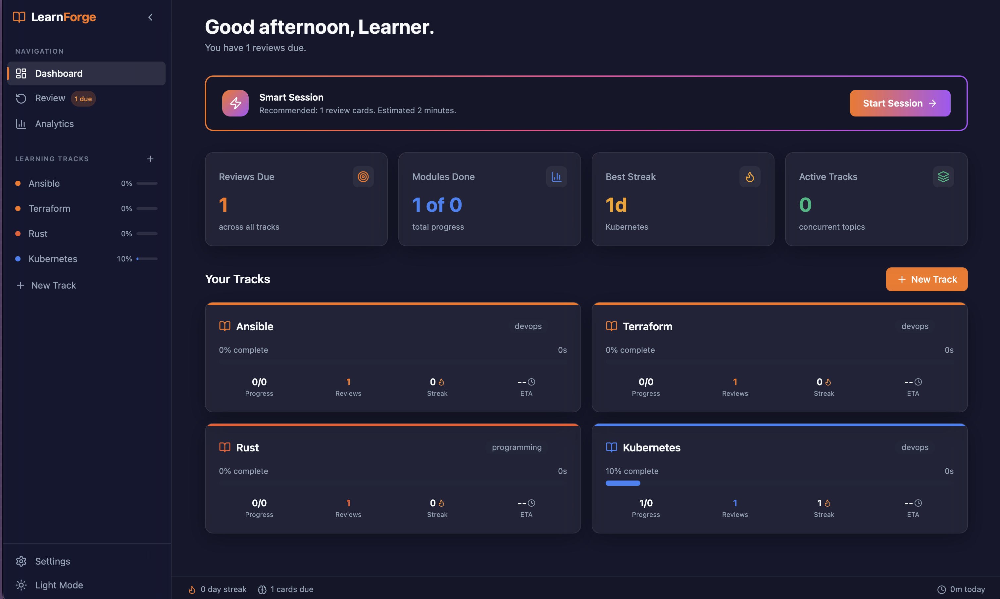
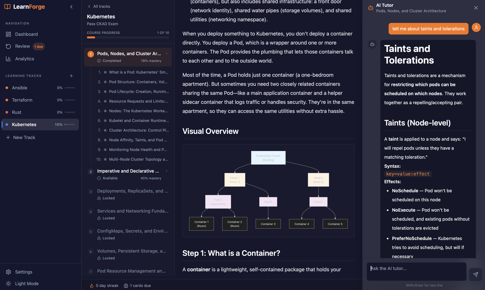

<h1 align="center">SkillCoco</h1>

<p align="center">
  <strong>Adaptive learning for any subject — powered by real learning science, not video completion theater.</strong>
</p>

<p align="center">
  <a href="LICENSE"></a>
  <a href="https://github.com/skillcoco/skillcoco/actions/workflows/cla.yml"></a>
  
  
  
  
</p>

<p align="center">
  <em>Replaces "did they watch the video?" with "can they actually do this?" — and adapts the entire course around the answer.</em>
</p>

---

SkillCoco is an **open-source, offline-capable desktop application** for adaptive learning — languages, programming, music theory, history, anything you want to learn. It combines **Bayesian Knowledge Tracing (BKT)**, **SM-2 spaced repetition**, AI-generated content shaped by demonstrated mastery, and (when the topic is technical) AI-judged hands-on terminal labs — into a single local-first mastery loop. The whole course reshapes per learner. No cloud required. No vendor lock-in. MIT licensed.

Type any subject in the onboarding ("Spanish", "Watercolor", "Kubernetes", "Music Theory") and the engine generates an adaptive path. Bring your own API key (Anthropic, OpenAI, or Gemini) or run fully offline with a local Ollama model. Every algorithm is auditable in the source code.

---

## Open core

SkillCoco is the **open-source core of the SkillCoco platform**. This repository —
the adaptive learning engine (BKT + SM-2 + microlearning), the open pack format,
lessons, video, quizzes, gamification, and the AI tutor (bring your own key or run
local models) — is MIT licensed and always will be.

Commercial products by Initcron Systems build on top of it:

- **SkillCoco Pro** — the integrated learning environment: embedded terminal + IDE,
  validated and graded hands-on labs, interactive simulators, exam simulators.
- **SkillCoco Hub** — course licensing, verifiable certificates, progress sync,
  and cohort reporting for educators and corporate teams.
- **SkillCoco Studio** — course authoring and AI enrichment for educators.

Contributions here improve the open core. See [CONTRIBUTING.md](./CONTRIBUTING.md).

---

## Preview

<table>
  <tr>
    <td width="50%" valign="top">
      <a href="docs/screenshots/01-dashboard.png">
        
      </a>
      <p align="center"><sub><strong>Dashboard</strong> — Smart Session recommends the next action (review due cards, continue a track). Stats are real BKT mastery and SR review queue, not video-completion theater.</sub></p>
    </td>
    <td width="50%" valign="top">
      <a href="docs/screenshots/02-lesson.png">
        
      </a>
      <p align="center"><sub><strong>Lesson view</strong> — AI-generated content shaped by learner state, with the AI Tutor always one click away. The tutor receives the active section as primary context, so answers are grounded in what's on screen.</sub></p>
    </td>
  </tr>
</table>

---

## What makes SkillCoco different

### 1. Real Bayesian Knowledge Tracing (BKT) adaptive mastery

SkillCoco implements Corbett & Anderson's 1994 **Bayesian Knowledge Tracing** algorithm — the same model that powers Carnegie Mellon's Cognitive Tutors. Every quiz answer and flashcard response updates a per-skill posterior probability of mastery. Modules unlock only when the learner *demonstrates* understanding. There is no "did they watch the video?" proxy.

Source: [`src-tauri/src/learning/adaptive.rs`](src-tauri/src/learning/adaptive.rs)

### 2. AI-judged hands-on lab steps with rubrics

Terminal labs are evaluated in three layers: regex/exit-code checks (instant, deterministic), and — as a last resort — an **AI judge** that scores open-ended steps against a per-step rubric. The AI judge is budget-guarded (5 calls + 2s cooldown per session) with a graceful no-auth fallback. Evaluation never silently passes.

### 3. Spaced repetition (SM-2) tuned to mastery decay

When a module is mastered, **SM-2 flashcard reviews** are auto-generated and scheduled at scientifically-optimal intervals based on Wozniak's 1990 forgetting-curve model. Reviews are not optional: the dashboard surfaces the SR queue alongside new content. Mastery doesn't mean "learned once."

Source: [`src-tauri/src/learning/spaced_repetition.rs`](src-tauri/src/learning/spaced_repetition.rs)

### 4. Local-first desktop, offline-capable

SkillCoco ships as a ~10 MB Tauri 2 binary. All algorithms run in-process (BKT, SM-2, SQLite WAL, RuVector). No telemetry. No internet required for the core loop. AI content generation is optional — the engine works without it.

### 5. BYO API key — Anthropic, OpenAI, Gemini, or local Ollama

There is no hosted AI backend to pay for or trust. Sign in with your existing Claude Pro / ChatGPT Plus / Gemini Advanced subscription (OAuth), paste a BYOK key, or point SkillCoco at a local Ollama instance. The AI integration is a feature, not a paywall.

### 6. The only open-source adaptive-learning platform with built-in hands-on labs

SkillCoco is MIT licensed. The full adaptive engine, BKT, SM-2, AI integration, and embedded PTY terminal are open source and auditable. There is no other open-source adaptive learning platform that combines all of these in a single installable binary.

---

## Quick start

```bash
# Prerequisites: Node 18+, pnpm 8+, Rust stable, Tauri 2 prerequisites
# Optional: Docker (labs fall back to host shell without it)

git clone https://github.com/skillcoco/skillcoco.git
cd skillcoco
pnpm install
cargo build --manifest-path src-tauri/Cargo.toml
pnpm tauri dev
```

---

## Architecture

SkillCoco is a Tauri 2 desktop application: a Rust backend (`src-tauri`) communicating with a React 18 + Vite frontend over a type-checked camelCase IPC contract. The Rust backend embeds SQLite (via `rusqlite`, WAL mode), RuVector (in-process vector + graph DB), and all learning-science algorithms. The frontend renders the adaptive UI, the embedded PTY terminal (xterm.js v5 + `portable-pty`), and the AI Tutor sidebar. All state transitions are event-sourced through versioned, idempotent migrations (`v001`–`v006`). Docker is used for isolated lab sandboxes when available, with a host-shell fallback.

---

## Open source

All code in this repository is MIT licensed — the adaptive engine, the pack
format, and the desktop app. See the [Open core](#open-core) section above for
how this repository relates to the commercial SkillCoco products.

The core Rust crate (currently named `skillcoco-core` in code; renaming to
`skillcoco-core` before its first crates.io publish) carries the learning-science
algorithms and pack format. The backend exposes a `SkillCocoPlugin` trait for
community extensions (backend-only internal seam; no API-stability promise yet).

See [`LICENSING.md`](LICENSING.md) for the license summary.

---

## Contributing

Contributions are welcome. Please read [CONTRIBUTING.md](./CONTRIBUTING.md) before opening a pull request. All contributors must sign the [Contributor License Agreement](./CLA.md) on their first PR.

---

## License

| What | License |
|------|---------|
| All source code | **MIT** (`LICENSE`) |
| Third-party attributions | [`THIRD_PARTY_NOTICES.md`](THIRD_PARTY_NOTICES.md) |

See [`LICENSING.md`](LICENSING.md) for the full boundary explanation.

Adaptive learning algorithms should be open, auditable, and patent-free. That is the design.

---

<p align="center"><em>An Agentix Garage and School of DevOps / School of AI project. Built in the open since March 2026.</em></p>
